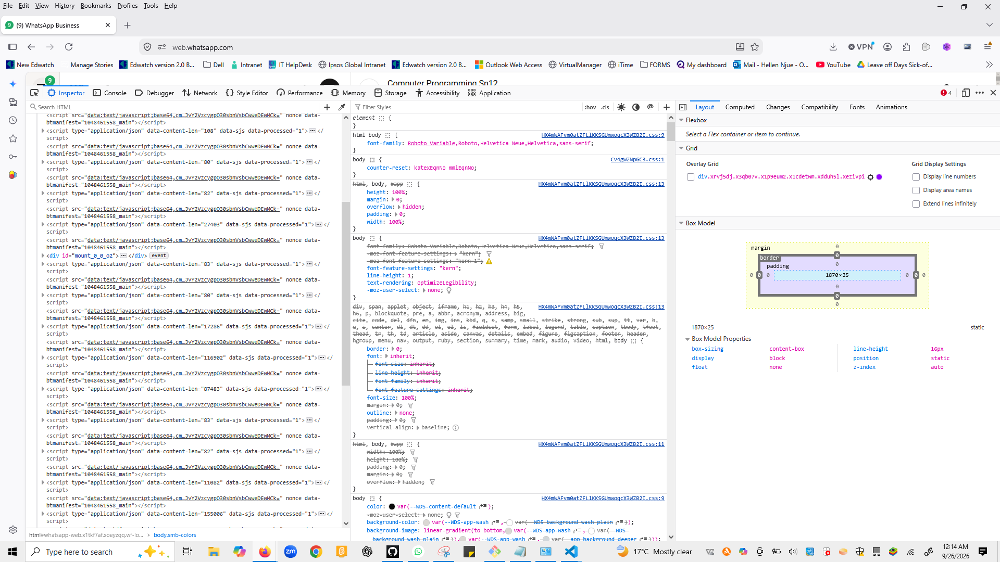

# Task 1.2: DevTools Exploration

## Website 1: https://example.com
1. **What HTML tags are used on the page?**
   - `<html>`, `<head>`, `<meta>`, `<title>`, `<style>`, `<body>`, `
`, `<h1>`, `
`, `<a>`
2. **What is the page title?**
   - Example Domain
3. **How many headings are there?**
   - 1 heading (an `<h1>` tag)

## Website 2: https://mozilla.org
1. **Find the navigation menu - what tag is it wrapped in?**
   - wrapped in a <nav> element.
2. **How is the search bar structured?**
   - structured as a <form> containing an <input type="search"> field.
3. **What happens when you hover over links (check the styles)?**
   - The text color changes and gets an underline via the CSS :hover pseudo-class.

## Website 3: Any website of your choice
1. **Identify 5 different HTML elements:**
   -  `<html>`, `<head>`, `<body>`, `
`, `<script>`
2. **Find a form element and list its inputs:**
   - A search element containing a `
` text-box wrapper housing a text input with `type="text"`, `role="textbox"`, and `contenteditable="true"`.
3. **Elements Panel Screenshot:**
   - 

### Extra Discovery — Active CSS Rules
- Found root body font rendering configurations: `font-family: Roboto Variable,Roboto,Helvetica Neue,Helvetica,sans-serif;`
- Found system-wide dark/light token design variables like `--WDS-content-default: #0A0A0A;` and `--WDS-accent-deemphasized: #F1EEEB;` used to style the interactive text layout.